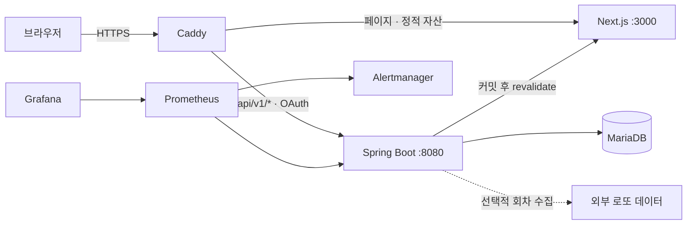

# KRAFT Lotto

KRAFT Lotto는 로또 6/45 당첨 데이터 조회와 통계, 번호 추천, 저장 번호 확인, OAuth2 커뮤니티를 한곳에서 제공하는 웹 서비스입니다.

[](#기술-구성)
[](#기술-구성)
[](#기술-구성)
[](#기술-구성)
[](#기술-구성)

- 운영 서비스: [https://kraft.io.kr](https://kraft.io.kr/)
- 운영 기준 커밋: `c9686b3a10e3`
- 통합 기술 문서: [`docs/improvement.md`](docs/improvement.md)

Google·Naver 로그인부터 세션 유지, 게시글·댓글·답글 작성, 수정·삭제, 로그아웃까지 실제 브라우저 사용자 흐름을 검증했습니다.

> 번호 추천은 통계적 참고 기능입니다. 모든 로또 6/45 조합의 1등 당첨 확률은 동일하며, 서비스는 당첨을 보장하지 않습니다.

## 제공 기능

### 로또 데이터

- 최신·과거 당첨 회차와 데이터 신선도 조회
- 번호별 빈도, 홀짝·고저·합계 구간, 동반 출현 통계
- 제외 번호와 공동 당첨 위험 완화 옵션을 반영한 조합 추천
- 과거 1등 조합과 추천 조합의 중복 검사
- 익명 기기 토큰 기반 번호 저장과 회차별 당첨 결과 확인
- 공개 서비스 상태와 최근 수집·보정 이력 제공

### 커뮤니티

- Google·Naver OAuth2 로그인
- 게시글 작성, 조회, 수정, 삭제
- 댓글과 한 단계 답글
- 답글이 있는 댓글을 문맥 보존 상태로 삭제하는 tombstone 정책
- CSRF 보호, 작성자 권한 검사, 신고 제한

### 운영

- 최신 회차 자동 수집과 수동 백필
- 통계 요약 재계산과 데이터 reconciliation
- 감사 로그와 운영 API
- Prometheus, Grafana, Alertmanager 관측
- 배포 후 API·페이지·OAuth redirect 스모크 테스트
- 이미지 취약점 검사, SBOM, provenance, CodeQL

## 기술 구성

| 영역 | 기술 |
| --- | --- |
| 백엔드 | Java 25, Spring Boot 4.1.0, Spring Security, OAuth2 Client, Spring Data JPA, Validation, Actuator, Thymeleaf |
| 데이터 | MariaDB 11.7, Flyway V1~V17, H2, Caffeine |
| 복원력 | Virtual Threads, ShedLock, Resilience4j, 트랜잭션 이벤트 |
| 프런트엔드 | Next.js 16.2.11 App Router, React 19.2.7, TypeScript 6.0.3, ISR, CSP nonce |
| 테스트 | JUnit 5, Testcontainers, JaCoCo, Checkstyle, SpotBugs, Vitest, Testing Library, Playwright |
| 인프라 | Docker Compose, Caddy, Prometheus, Grafana, Alertmanager, GHCR |
| 자동화 | GitHub Actions, CodeQL, Dependabot, Trivy, SBOM·provenance |

## 서비스 구조



Caddy만 외부 요청을 받습니다. 페이지와 정적 자산은 Next.js로, `/api/v1/*`, `/oauth2/*`, `/login/*`, `/logout`은 Spring Boot로 전달합니다. 관리자·운영·Actuator 경로는 공개 도메인에서 차단하며, 관리자 도메인과 IP allowlist로 별도 보호합니다.

### 요청과 데이터 흐름

1. 자동 수집기가 최신 당첨 회차를 확인하고 실패 시 제한적으로 재시도합니다.
2. 수집과 수동 보정은 idempotent upsert와 동시성 가드를 통과합니다.
3. 커밋 후 통계 요약을 갱신하고 관련 Next.js ISR 경로를 무효화합니다.
4. reconciliation이 원본 회차와 통계 요약의 최신 상태를 비교해 지연을 복구합니다.
5. 운영 로그와 감사 로그는 보존 기간에 따라 정리됩니다.

## 보안 모델

Spring Security는 범위가 좁은 체인부터 다음 순서로 적용됩니다.

1. 로컬 H2 콘솔: 로컬 프로필 전용
2. 관리자: `/admin/**`, 세션 로그인, CSRF, 동시 세션 1개
3. 커뮤니티: `/api/v1/community/**`, OAuth2 세션, double-submit CSRF
4. 공개·운영 API: `/api/**`, `/actuator/**`, `/ops/**`, stateless

운영 커뮤니티 쿠키에는 `Secure`, `HttpOnly`, `SameSite=Lax`, host-only 속성을 적용합니다. 세션에는 OAuth 공급자의 토큰이나 원본 프로필을 보관하지 않고 내부 사용자 ID만 유지합니다. 개인화 응답은 `private, no-store`이며 공개 ISR HTML에는 사용자 상태를 포함하지 않습니다.

상태 변경 요청은 `XSRF-TOKEN` 쿠키 값을 `X-XSRF-TOKEN` 헤더로 전송해야 합니다. 미인증 요청은 `401`, CSRF 검증 실패는 `403`으로 구분합니다.

## 저장소 구성

```text
src/main/java/com/kraft/
  admin/          관리자 로그인, 회차 수집, 백필, 감사 로그
  common/         설정, 보안, 오류 계약, 공통 로또 규칙
  community/      OAuth2, 사용자, 게시글, 댓글
  operationlog/   수집·보정 이력과 공개 인시던트
  ops/            운영 API와 서비스 상태
  recommend/      번호 추천과 과거 당첨 조합 배제
  saved/          기기 토큰 기반 저장 번호
  statistics/     통계 계산과 요약
  winningnumber/  회차 조회, 외부 수집, 자동 수집

src/main/resources/
  db/migration/   Flyway V1~V17
  templates/      관리자 Thymeleaf 화면

web/
  src/app/        Next.js 페이지와 Route Handler
  src/components/ 화면 구성과 클라이언트 상태
  src/lib/        API, 검증, 분석, CSRF, 로깅
  e2e/            기본·콘텐츠·광고 Playwright 테스트

caddy/            운영·로컬 동일 출처 라우팅
infra/            모니터링과 경보 설정
scripts/          개발, 검증, 배포, 롤백, 백업·복구
docs/             통합 기술 문서와 개선 로드맵
```

## 로컬 실행

### 준비 사항

- JDK 25
- Node.js 24 이상과 npm
- Docker Desktop 또는 Docker Engine
- Bash 스크립트 실행이 필요한 경우 Git Bash 또는 WSL

### H2 백엔드

```powershell
.\scripts\dev-backend.ps1
```

첫 실행에서는 `.env.local.example`을 `.env.local`로 복사하고 종료합니다. 생성된 환경 파일을 검토한 다음 같은 명령을 다시 실행합니다.

- 백엔드: <http://localhost:8080>
- H2 콘솔: <http://localhost:8080/h2-console>
- 로컬 관리자 기본값: `admin` / `admin`

기본 관리자 계정은 로컬 개발 전용입니다.

### Next.js

백엔드를 먼저 실행한 뒤 다른 PowerShell에서 시작합니다.

```powershell
.\scripts\dev-web.ps1
```

- 프런트엔드: <http://localhost:3000>
- 기본 백엔드 주소: `http://localhost:8080`

### MariaDB 개발 모드

```powershell
.\scripts\dev-db.ps1
.\scripts\dev-backend.ps1 -MariaDB
```

두 번째 명령을 실행하기 전에 `.env.local`의 MariaDB 설정을 활성화합니다.

### 전체 Docker Compose

```powershell
Copy-Item .env.example .env
```

`.env`에 DB 비밀번호, Ops 토큰, revalidate secret, Grafana 비밀번호를 설정합니다. 그다음 Git Bash 또는 WSL에서 로컬용 Alertmanager 설정을 만들고 서비스를 시작합니다.

```bash
ALERTING_DISABLED=true bash scripts/deploy/render-alertmanager.sh
docker compose up -d --build
```

`ALERTING_DISABLED=true`는 로컬·스테이징에서만 사용합니다. 운영에서는 실제 경보 webhook을 설정해야 합니다.

`infra/alertmanager/alertmanager.yml`은 Git에 커밋되지 않으므로(clean clone에는 없음), 렌더 스크립트보다 `docker compose up`을 먼저 실행하면 Docker가 그 경로를 빈 디렉터리로 자동 생성해버려 이후 렌더가 "Is a directory" 오류로 실패합니다. 이 경우 `rmdir infra/alertmanager/alertmanager.yml` 실행 후 렌더 스크립트를 다시 실행하세요.

`scripts/deploy/up-full-stack.sh`는 렌더→(Caddy 포함) 기동→smoke test를 한 번에 실행하는 로컬 전용 편의 스크립트입니다. smoke test는 Caddy가 만드는 단일 진입점(`http://localhost`)을 전제로 하므로 아래 OAuth2 로컬 설정과 같은 `docker-compose.local.yml` 조합으로 띄웁니다 — clean clone 직후 전체 스택이 정상 동작하는지 한 번에 확인하고 싶을 때 씁니다.

## OAuth2 로컬 설정

공급자 callback과 세션 쿠키를 운영과 같은 동일 출처 구조로 시험하려면 로컬 Caddy를 사용합니다.

```bash
docker compose -f docker-compose.yml -f docker-compose.local.yml up -d --build
```

접속 주소는 반드시 <http://localhost>를 사용합니다. `.env`에 사용할 공급자의 ID와 secret을 넣고 해당 Spring profile을 활성화합니다.

```dotenv
SPRING_PROFILES_ACTIVE=local,community-google-oauth,community-naver-oauth
KRAFT_COMMUNITY_GOOGLE_CLIENT_ID=
KRAFT_COMMUNITY_GOOGLE_CLIENT_SECRET=
KRAFT_COMMUNITY_NAVER_CLIENT_ID=
KRAFT_COMMUNITY_NAVER_CLIENT_SECRET=
```

공급자 콘솔에 등록할 callback은 다음과 같습니다.

```text
http://localhost/login/oauth2/code/google
http://localhost/login/oauth2/code/naver
```

운영에서는 같은 경로의 `https://kraft.io.kr` 주소를 등록합니다. Google은 공개 프로필 범위만 사용하고, Naver 사용자 별칭은 `nickname`만 저장합니다. ID와 secret은 반드시 한 쌍으로 설정하며 저장소에 커밋하지 않습니다.

## 주요 API

### 공개·개인 API

| Method | Endpoint | 설명 |
| --- | --- | --- |
| `GET` | `/api/v1/rounds/latest` | 최신 당첨 회차 |
| `GET` | `/api/v1/rounds/freshness` | 데이터 신선도 |
| `POST` | `/api/v1/numbers/recommend` | 추천 조합 생성 |
| `GET` | `/api/v1/numbers/check` | 과거 1등 조합 검사 |
| `GET` | `/api/v1/stats/frequency` | 번호별 빈도 |
| `GET` | `/api/v1/stats/patterns` | 홀짝·고저·합계 패턴 |
| `GET` | `/api/v1/stats/companion` | 동반 출현 통계 |
| `POST` | `/api/v1/stats/analysis` | 여섯 번호 조합 분석 |
| `GET`, `POST`, `DELETE` | `/api/v1/saved/**` | 저장 번호 관리 |
| `GET` | `/api/v1/status`, `/api/v1/status/incidents` | 서비스 상태와 공개 이력 |

저장 번호 API는 인증 계정 대신 익명 기기 토큰을 사용합니다.

### 커뮤니티 API

| Method | Endpoint | 접근 조건 |
| --- | --- | --- |
| `GET` | `/api/v1/community/session` | 선택적 세션 |
| `GET` | `/api/v1/community/posts`, `/posts/{id}` | 공개 |
| `POST`, `PUT`, `DELETE` | `/api/v1/community/posts/**` | OAuth2 세션 + CSRF |
| `GET` | `/api/v1/community/posts/{id}/comments` | 공개 |
| `POST` | `/api/v1/community/posts/{id}/comments` | OAuth2 세션 + CSRF |
| `DELETE` | `/api/v1/community/comments/{id}` | OAuth2 세션 + CSRF |

`/ops/**`는 `X-Ops-Token`이 필요합니다. `/admin/**`은 별도 관리자 도메인의 세션 인증과 IP allowlist를 사용합니다.

## 환경 파일

| 파일 | 용도 |
| --- | --- |
| `.env.local.example` | Spring Boot 직접 실행 |
| `.env.example` | 기본·로컬 Docker Compose |
| `.env.prod.example` | 운영 CD 환경 렌더링 |
| `web/.env.local.example` | Next.js 직접 실행 |
| `web/.env.example` | Next.js 컨테이너와 빌드 |

실제 `.env*`, OAuth secret, DB 비밀번호, Ops 토큰은 커밋하지 않습니다.

## 검증

### 백엔드

```powershell
.\gradlew.bat clean check bootJar `
  -PstrictStatic=true `
  -PstrictCoverage=true `
  --console=plain
```

현재 기준은 70 suites, 394 tests, 실패·오류·skip 0입니다. JaCoCo 실측은 line 88.43%, branch 78.30%, method 92.86%, class 98.84%입니다.

### 프런트엔드

```powershell
Set-Location web
npm ci
npm run lint
npm run typecheck
npm run test:coverage
npm run build
npm run test:e2e
npm run test:e2e:content
```

Vitest는 145개 테스트를 실행합니다. 현재 커버리지는 statements 71.74%, branches 68.41%, functions 68.10%, lines 73.76%입니다.

고정 광고 오버레이는 별도 build 디렉터리와 환경값으로 검증합니다.

```powershell
$env:NEXT_DIST_DIR = ".next-ad-overlay"
$env:NEXT_PUBLIC_KAKAO_ADFIT_UNIT_STICKY = "DAN-local-overlay-test"
npm run build
npm run test:e2e:ad-overlay
Remove-Item Env:NEXT_DIST_DIR
Remove-Item Env:NEXT_PUBLIC_KAKAO_ADFIT_UNIT_STICKY
```

## CI/CD

| 워크플로 | 역할 |
| --- | --- |
| `ci.yml` | 백엔드·프런트 빌드와 테스트, 정적 분석, E2E, Caddy 검증, 이미지 게시·스캔 |
| `pr.yml` | PR 의존성 취약점 검사 |
| `codeql.yml` | Java와 JavaScript/TypeScript CodeQL |
| `cd.yml` | 성공한 `main` CI의 정확한 SHA 배포와 실패 시 rollback |

배포 파이프라인은 필수 환경값과 OAuth 자격 증명 쌍을 검증하고, GHCR 이미지 digest로 서비스를 기동합니다. readiness, 핵심 API와 페이지, Google·Naver 로그인 redirect, Flyway 버전을 확인하며 실패 시 이전 이미지로 되돌립니다.

현재 운영 기준 실행은 [CI 30083045641](https://github.com/portuna85/Kraft/actions/runs/30083045641), [CodeQL 30083045646](https://github.com/portuna85/Kraft/actions/runs/30083045646), [CD 30083324962](https://github.com/portuna85/Kraft/actions/runs/30083324962)입니다.

## 운영 명령

```bash
# 운영 환경 렌더링과 검증
bash scripts/deploy/render-env.sh .env.prod.example .env.prod
set -a
source .env.prod
set +a
bash scripts/deploy/validate-env.sh

# 백업과 복구 훈련
bash scripts/db-backup.sh
bash scripts/db-restore-drill.sh

# 배포 후 스모크 테스트
bash scripts/deploy/smoke-test.sh
```

`scripts/archive/migrate-2026-06/`는 완료된 일회성 데이터 이전 기록입니다. 현재 운영 도구로 재사용하지 않으며, 남은 주의사항은 통합 기술 문서에 기록되어 있습니다.

## 문서 정책

프로젝트 Markdown 문서는 이 README와 [`docs/improvement.md`](docs/improvement.md) 두 개만 유지합니다.

- `README.md`: 서비스 소개, 실행, API, 검증, 배포의 시작점
- `docs/improvement.md`: 상세 설계 결정, OAuth 설정, 운영 런북, 구현 이력, 우선순위별 개선 과제

`docs/**/*.md`는 현재 `.gitignore` 정책상 로컬 전용입니다. 문서를 원격 저장소에서 공동 관리하려면 추적 정책을 별도로 변경해야 합니다.
