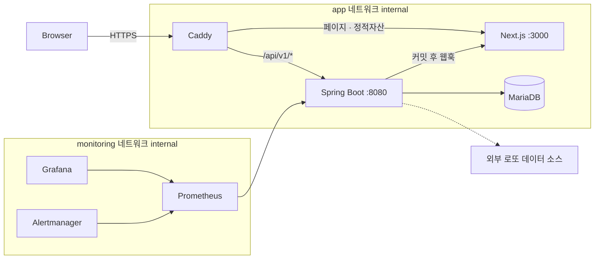

# 🎰 KRAFT Lotto

로또 6/45 당첨 결과, 통계, 번호 추천, 저장 번호 관리를 제공하는 서비스

[](#기술-스택)
[](#기술-스택)
[](#기술-스택)
[](#기술-스택)
[](#기술-스택)
[](#기술-스택)

**운영 사이트:** [kraft.io.kr](https://kraft.io.kr/)

백엔드는 Spring Boot(Java 25), 프론트엔드는 Next.js App Router(React 19)로 만들어졌고, Docker Compose + Caddy + MariaDB 조합으로 배포됩니다.

---

## 목차

- [무엇을 하는 서비스인가](#무엇을-하는-서비스인가)
- [기술 스택](#기술-스택)
- [아키텍처](#아키텍처)
- [저장소 구조](#저장소-구조)
- [로컬에서 실행하기](#로컬에서-실행하기)
- [환경 파일](#환경-파일)
- [API 개요](#api-개요)
- [데이터 수집 흐름](#데이터-수집-흐름)
- [테스트](#테스트)
- [CI/CD](#cicd)
- [운영 배포](#운영-배포)
- [문제 해결](#문제-해결)

---

## 무엇을 하는 서비스인가

- 최신 당첨 결과와 전체 회차 목록/검색, 회차 상세(번호 구성 분석 포함)
- 통계 기반 번호 추천(제외 번호 지정, 공동 당첨 회피 옵션), 과거 1등 조합과 중복 검사
- 번호별 출현 빈도, 홀짝/고저/합계 구간 패턴, 동반 출현 조합 통계
- 브라우저 기기 토큰 기반 번호 저장·관리, 특정 회차 당첨 대조
- 데이터 최신성과 최근 수집/보정 이력을 보여주는 공개 상태 페이지
- 회차 수동 입력, 외부 수집 트리거, 감사 로그를 갖춘 운영/관리자 화면

> 번호 추천은 통계적 참고용이며 당첨을 보장하지 않습니다.

## 기술 스택

| 영역 | 구성 |
| --- | --- |
| **백엔드** | Java 25, Spring Boot 4.1(Web/Validation/Data JPA/Security/Actuator/Thymeleaf), MariaDB 11.7(Flyway 마이그레이션), H2(로컬/테스트), Caffeine 캐시, ShedLock(스케줄러 중복 실행 방지), Resilience4j 서킷브레이커(외부 API 격리) |
| **프론트엔드** | Next.js 16(App Router), React 19, TypeScript, Server Components + ISR, 요청별 CSP nonce |
| **테스트/품질** | JUnit 5 + Testcontainers(MariaDB), JaCoCo, Checkstyle, SpotBugs / Vitest + Testing Library, Playwright / CodeQL, Trivy, Dependabot |
| **인프라** | Docker Compose, Caddy(에지 라우팅·TLS), Prometheus + Grafana + Alertmanager, GHCR |

## 아키텍처



공개 도메인에서 Caddy는 `/api/v1/*`를 백엔드로 직결하고 나머지 페이지 요청은 Next.js로 보냅니다. `/admin*`, `/ops*`, `/actuator*`는 공개 도메인에서 403으로 차단되며, 별도 관리자 도메인에서만(IP allowlist 적용 가능) 접근할 수 있습니다. 운영 compose는 `app`/`monitoring` 네트워크를 `internal: true`로 분리해 Caddy만 외부에 노출합니다.

## 저장소 구조

```text
src/main/java/com/kraft/
  admin/          관리자 콘솔(로그인, 회차 수집/백필, 감사 로그, 로그인 잠금)
  common/         설정, 전역 예외 처리, 로또 번호 유틸, 필터/IP 판별/ETag
  ops/            /ops/** 운영 API, 공개 상태 요약
  operationlog/   수집/보정 이력, 공개 인시던트 피드, 보관 정리 스케줄러
  recommend/      추천 스코어링, 과거 당첨 조합 검사
  saved/          기기 토큰 기반 저장 번호
  statistics/     빈도·패턴·동반출현 요약, 재계산, 조합 분석
  winningnumber/  회차 조회, 외부 수집, 자동수집·신선도 스케줄러, ISR 리밸리데이션

web/src/
  app/            페이지, 라우트 핸들러, 특수 파일(robots/sitemap/OG)
  components/     UI 컴포넌트
  lib/            API 클라이언트, 분석, 검증, 기기 토큰 등 유틸

caddy/            라우팅, 보안 헤더, 캐시 정책
infra/            Prometheus/Grafana/Alertmanager 설정
scripts/          로컬 실행, 배포, 서버 초기화, DB 백업/복구
```

## 로컬에서 실행하기

> 요구 사항: JDK 25, Node.js 24+, npm, (선택) Docker.

**백엔드만 — H2 메모리 DB, 가장 빠름**

```powershell
.\scripts\dev-backend.ps1
```

`.env.local`이 없으면 `.env.local.example`에서 자동 생성됩니다. http://localhost:8080 , 관리자 로그인은 `/admin/login`(로컬 기본 계정 `admin`/`admin` — 실제 환경에서 재사용 금지).

**프론트엔드**

```powershell
.\scripts\dev-web.ps1
```

`web/.env.local`이 없으면 `web/.env.local.example`에서 자동 생성되고 백엔드를 `localhost:8080`으로 가리킵니다. http://localhost:3000

**MariaDB로 개발하고 싶다면**

```powershell
.\scripts\dev-db.ps1
```

`.env.local`의 MariaDB 섹션 주석을 해제하면 H2 대신 사용됩니다.

**전체 스택(Docker)**

```powershell
copy .env.example .env
docker compose up -d --build
```

`docker-compose.yml`은 기본적으로 모든 포트를 `127.0.0.1`에만 바인딩합니다. 다른 기기에서 접속하려면 `docker-compose.local.yml`을 함께 적용하세요.

## 환경 파일

| 파일 | 용도 |
| --- | --- |
| `.env.local.example` | 백엔드를 로컬에서 직접 실행할 때(H2 기본) |
| `.env.example` | 로컬 Docker Compose |
| `.env.prod.example` | 운영 배포(CD가 GitHub Secrets로 렌더링) |
| `web/.env.local.example` | 프론트를 단독 `npm run dev`로 실행할 때 |
| `web/.env.example` | 프론트 Docker 빌드 |

주요 변수는 각 example 파일의 주석을 참고하세요 — 외부 수집 URL, Ops 토큰, revalidate secret, 관리자 CIDR, rate limit 설정 등이 있습니다. 외부 수집 URL이 비어 있으면 수집 기능은 자동으로 비활성화됩니다.

## API 개요

공개 API는 `/api/v1/*`(stateless, 세션 없음)입니다.

| Method | Endpoint | 설명 |
| --- | --- | --- |
| GET | `/rounds/latest` | 최신 당첨 회차 |
| GET | `/rounds/{round}` | 회차 상세 |
| GET | `/rounds?page=&size=` | 회차 목록 |
| GET | `/rounds/freshness` | 데이터 최신성 |
| POST | `/numbers/recommend` | 추천 조합 생성 |
| GET | `/numbers/check?numbers=` | 과거 1등 조합 여부 |
| GET | `/stats/frequency`, `/stats/patterns`, `/stats/companion` | 통계 |
| POST | `/stats/analysis` | 번호 6개 조합 분석 |
| GET/POST/DELETE | `/saved`, `/saved/{id}` | 저장 번호(`X-Device-Token` 필요) |
| GET | `/saved/matches?round=` | 저장 번호 당첨 대조 |
| GET | `/status`, `/status/incidents` | 서비스 상태, 공개 이력 |

운영 API(`/ops/*`)는 `X-Ops-Token` 헤더가 필요하고, 관리자 화면(`/admin/*`)은 Thymeleaf 기반 세션 로그인으로 보호됩니다. 두 경로 모두 운영 환경에서는 별도 관리자 도메인 + IP allowlist로 한 번 더 보호됩니다.

## 데이터 수집 흐름

1. 매주 토요일 밤 자동 수집을 시도하고, 실패하면 짧은 간격으로 재시도하며 회차 지연 정도(gap)에 따라 자동으로 여러 회차를 따라잡습니다.
2. 수집 성공 시 트랜잭션 커밋 이후 통계 요약을 갱신하고, 뒤처짐이 감지되면 재조정 스케줄러가 자동으로 전체 재계산합니다.
3. Next.js에는 웹훅으로 on-demand 재검증을 요청해 캐시된 페이지를 최신 상태로 되돌립니다.
4. 회차 수동 보정(운영 화면)도 자동 수집과 동일한 이벤트 경로를 타므로 통계·캐시·ETag가 함께 갱신됩니다.
5. 오래된 운영/감사 로그는 매일 배치로 정리됩니다.

## 테스트

```powershell
# 백엔드
.\gradlew.bat test bootJar
.\gradlew.bat check -PstrictStatic=true    # Checkstyle + SpotBugs, 반드시 커밋 전 실행

# 프론트엔드
cd web
npm ci
npm run lint
npx tsc --noEmit
npm test
npm run build
npm run test:e2e
```

백엔드는 패키지별 JaCoCo 커버리지 게이트가 있고, `FlywayMigrationTest`는 Testcontainers로 실제 MariaDB에 마이그레이션을 적용해 엔티티-스키마 정합성을 검증합니다(Docker 필요). 프론트는 Vitest 커버리지 게이트와 Playwright E2E(Desktop/Mobile/Tablet 3개 프로젝트)가 있습니다.

## CI/CD

| 워크플로 | 역할 |
| --- | --- |
| `ci.yml` | 백엔드/프론트 빌드·테스트, 정적 분석, Playwright E2E, Caddy 설정 검증, 이미지 publish(SBOM/provenance), Trivy 스캔 |
| `cd.yml` | CI 성공 후 SSH로 배포, readiness/smoke 테스트, 실패 시 자동 rollback |
| `codeql.yml` | 주간 정적 보안 분석 |
| `pr.yml` | PR 대상 의존성 취약점 스캔 |

> 1인 개발 프로젝트라 PR 없이 `main`에 직접 커밋·푸시합니다.

## 운영 배포

```bash
sudo bash scripts/server/init-ubuntu.sh   # 서버 최초 초기화
docker compose --env-file .env.prod -f docker-compose.prod.yml up -d
```

`scripts/deploy/`에 검증·렌더링·배포·롤백 스크립트가 있고, `scripts/db-backup.sh` / `db-restore-drill.sh`로 백업과 복구 드릴을 실행할 수 있습니다. Prometheus/Grafana/Alertmanager로 백엔드 다운, 5xx 비율, 응답 지연, 데이터 최신성 지연 등을 감시합니다.

## 문제 해결

| 증상 | 확인 |
| --- | --- |
| 프론트에서 데이터를 못 불러옴 | `web/.env.local`의 `KRAFT_BACKEND_INTERNAL_URL`이 실제 백엔드 주소를 가리키는지 |
| `/ops` 호출이 503 | `KRAFT_OPS_TOKEN`이 비어 있으면 비활성화됨 |
| 외부 수집이 503 | `KRAFT_EXTERNAL_LOTTO_URL_TEMPLATE` 설정 여부 |
| Docker 백엔드가 DB 연결 실패 | `.env`의 DB 비밀번호 값들이 일치하는지 |
| 다른 기기에서 로컬 스택 접속 불가 | `docker-compose.local.yml`을 함께 적용했는지 |

---

**KRAFT Lotto** · [kraft.io.kr](https://kraft.io.kr/)
