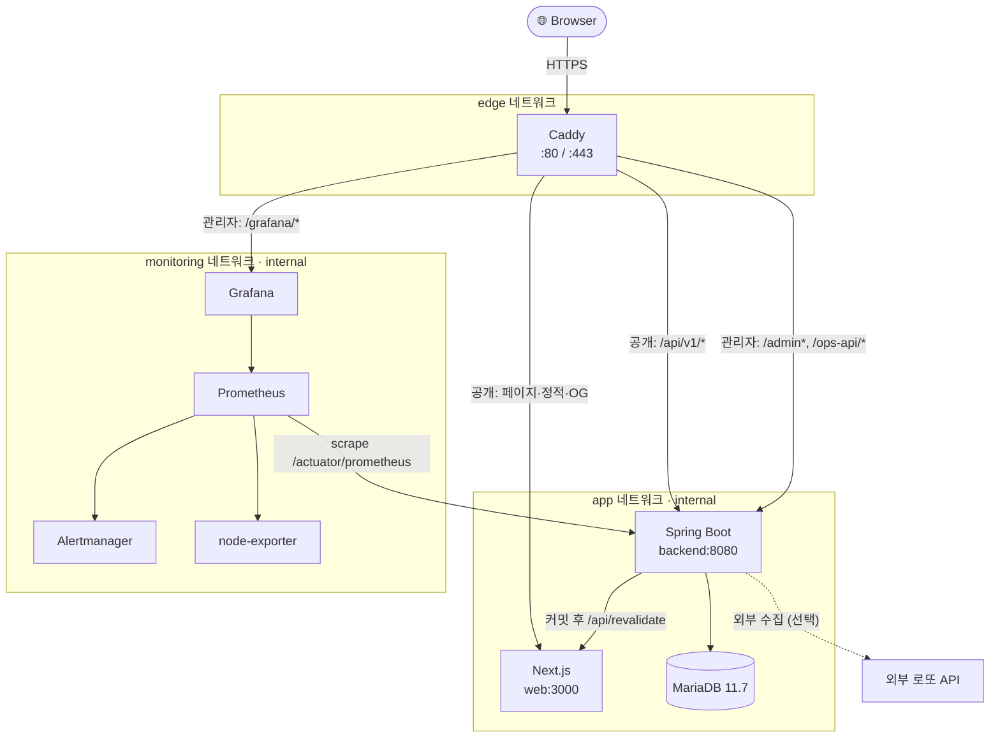

<div align="center">

# 🎰 KRAFT Lotto

**로또 6/45 당첨 결과 조회 · 번호 추천 · 통계 분석 · 저장 번호 관리 — 운영/관리자 대시보드까지**

[](https://kraft.io.kr/)
[](https://github.com/portuna85/Kraft/actions/workflows/ci.yml)
[](https://github.com/portuna85/Kraft/actions/workflows/codeql.yml)


</div>

KRAFT Lotto는 로또 6/45 당첨 결과 조회, 번호 추천, 통계 분석, 저장 번호 관리, 운영/관리자 대시보드까지 포함한 웹 서비스입니다. 백엔드는 Spring Boot(Java 25), 프론트엔드는 Next.js App Router(React 19)로 구성되어 있고, 운영 환경은 Docker Compose, Caddy, MariaDB, Prometheus, Grafana, Alertmanager를 기준으로 배포됩니다.

**목차** — [핵심 기능](#-핵심-기능) · [기술 스택](#-기술-스택) · [아키텍처](#-아키텍처) · [저장소 구조](#-저장소-구조) · [빠른 시작](#-빠른-시작) · [환경 파일](#-환경-파일) · [공개 화면](#-공개-화면) · [API 개요](#-api-개요) · [데이터 모델](#-데이터-모델) · [수집과 갱신 흐름](#-수집과-갱신-흐름) · [테스트와 품질 게이트](#-테스트와-품질-게이트) · [운영 배포](#-운영-배포) · [모니터링과 백업](#-모니터링과-백업) · [보안 메모](#-보안-메모) · [문제 해결](#-문제-해결)

---

## ✨ 핵심 기능

| 영역 | 기능 |
| --- | --- |
| **당첨 결과** | 최신 회차, 회차 목록/검색, 특정 회차 상세, 당첨금/판매액 조회 |
| **번호 추천** | 제외 번호와 추천 개수 설정, 과거 1등 조합 중복 확인, 저장 연계 |
| **저장 번호** | 브라우저 기기 토큰 기반 저장/조회/삭제, 특정 회차 당첨 결과 대조(등수 배지), 서버에는 토큰 해시만 보관 |
| **통계** | 번호별 출현 빈도(전체/최근 100·200·500회), 홀짝·고저·합계구간 패턴, 동반 출현 조합, 임의 조합 분석 |
| **상태 페이지** | 데이터 최신성, 최근 수집/보정 이력 공개 |
| **운영(Ops)** | 회차 직접 입력, 최신/특정 회차 외부 수집, 운영 로그 조회 (토큰 인증) |
| **관리자** | Thymeleaf 기반 관리자 로그인, 회차 수집/전체 백필, 감사 로그, 로그인 잠금 |
| **배포/운영** | Caddy 라우팅, TLS, 내부망 3분리, Prometheus/Grafana/Alertmanager 모니터링, DB 백업/복구 드릴 |

> [!NOTE]
> 번호 추천은 통계 기반 참고 기능입니다. 당첨을 보장하지 않습니다.

## 🧰 기술 스택

| 영역 | 사용 기술 |
| --- | --- |
| **Backend** | Java 25 (toolchain), Spring Boot 4.1.0, Spring Web/Validation/Data JPA/Security/Actuator/Thymeleaf |
| **Data** | MariaDB 11.7, Flyway (V1~V10), H2(local/test), Caffeine cache |
| **Batch/Resilience** | ShedLock 7.7.0, Resilience4j CircuitBreaker 2.4.0, Spring `@Scheduled`, 커밋 후 비동기 이벤트 리스너 |
| **Frontend** | Next.js 16.2.9 App Router, React 19.2.7, TypeScript, Server Components, ISR, CSP nonce 미들웨어 |
| **Test** | JUnit 5, Spring Test, Testcontainers(MariaDB, Flyway 검증용), JaCoCo, Vitest, Testing Library, Playwright |
| **Static/Security** | Checkstyle 10.23.0, SpotBugs 4.10.2, CodeQL, Trivy, Dependabot |
| **Infra** | Docker Compose, Caddy, Prometheus, Grafana, Alertmanager, node-exporter, GHCR |

## 🧱 아키텍처



**공개 도메인 라우팅**

| 경로 | 대상 | 캐시/비고 |
| --- | --- | --- |
| `/api/v1/*` | `backend:8080` | 공개 REST API |
| `/api/og/*` | `web:3000` | OG 이미지, 86400초 장기 캐시 |
| `/_next/static/*`, `/icon/*` 등 | `web:3000` | 1년 immutable 캐시 |
| `/*` | `web:3000` | 60초 SWR, 4xx/5xx는 no-store |
| `/admin*`, `/ops*`, `/actuator*`, `/api/revalidate` | 🚫 차단 | 403 |

**관리자 도메인 라우팅** — `KRAFT_ADMIN_ALLOWED_CIDR` IP allowlist가 최우선으로 적용됩니다.

| 경로 | 대상 | 비고 |
| --- | --- | --- |
| `/admin*` | Spring Boot Thymeleaf admin | 관리자 콘솔 |
| `/ops-api/*` | Spring Boot `/ops/*` | 운영 API 프록시 |
| `/grafana/*` | Grafana | 대시보드 |
| `/actuator*` | 🚫 차단 | 403 |

**구성 요소 메모**

- **Spring Boot** — MariaDB(app 네트워크) 연결, 외부 로또 수집 API(선택, 미설정 시 수집 기능 비활성), `/actuator/prometheus` 메트릭 노출, ShedLock 기반 스케줄러(수집/신선도 점검/로그 보관), 커밋 후 Next.js `/api/revalidate` 웹훅 호출.
- **Next.js** — SSR/ISR 공개 페이지 + Route Handler(로컬/E2E용 백엔드 프록시 폴백), 요청마다 CSP nonce 생성(`src/proxy.ts`), 프로덕션에서는 `/api/v1/*`를 Caddy가 백엔드로 직결(Next Route Handler 미경유).

운영용 `docker-compose.prod.yml`은 `edge`, `app`, `monitoring` 3개 네트워크로 분리되며 `app`/`monitoring`은 `internal: true`입니다. MariaDB, Prometheus, Grafana, Alertmanager, node-exporter는 호스트 포트를 열지 않고 Caddy만 `80`/`443`(및 로컬 전용 `127.0.0.1:2019` admin API)을 공개합니다. 모든 이미지는 digest로 고정됩니다.

## 📁 저장소 구조

```text
Kraft/
├── src/main/java/com/kraft/
│   ├── admin/           Thymeleaf 관리자 콘솔(로그인, 대시보드, 회차 수집/백필, 감사 로그, 로그인 잠금)
│   ├── common/          config(설정 프로퍼티), error(전역 예외 처리), lotto(번호 codec/등수/합계구간), web(필터·IP 판별·ETag)
│   ├── ops/             /ops/** 운영 API(토큰 인증)와 공개 /api/v1/status 요약
│   ├── operationlog/    수집/보정 작업 이력 저장·조회, 공개 인시던트 피드, 보관기간 정리 스케줄러
│   ├── recommend/       번호 추천 스코어링, 과거 1등 조합 검사
│   ├── saved/           기기 토큰 기반 저장 번호 저장/조회/삭제/회차 대조
│   ├── statistics/      빈도·패턴·동반출현 요약 캐시, 재계산기, 조합 분석
│   └── winningnumber/   회차 엔티티/조회, 외부 수집·매핑, 자동수집·신선도 스케줄러, ISR 리밸리데이션 이벤트
├── src/main/resources/
│   ├── db/migration/    Flyway SQL (V1~V10)
│   ├── templates/admin/ 관리자 Thymeleaf 템플릿
│   └── application*.yml base / local / prod
├── src/test/            백엔드 단위/통합 테스트(루트 패키지의 *IntegrationTest 포함),
│                        FlywayMigrationTest는 Testcontainers MariaDB 사용
├── web/
│   ├── src/app/         Next.js 페이지, 특수 파일(robots/sitemap/manifest/OG), Route Handler
│   ├── src/components/  UI 컴포넌트(서버/클라이언트 혼재)
│   ├── src/lib/         API 클라이언트, 포맷, 분석, 검증, 기기토큰, 로거, revalidate 상수 등 유틸
│   ├── src/__tests__/   Vitest 유닛 테스트
│   └── e2e/             Playwright 테스트(5개 spec, 3개 뷰포트 프로젝트)
├── caddy/               Caddy 라우팅, 보안 헤더, 캐시 정책
├── infra/               Prometheus(alert rules 포함), Grafana provisioning, Alertmanager
├── scripts/             dev 실행, 배포(deploy/), 서버 초기화(server/), 레거시 DB 이관(migrate/), DB 백업/복구
├── .github/             CI, CD, CodeQL, PR 의존성 스캔, Dependabot
└── docker-compose*.yml  dev / prod / dev DB 단독 / 로컬 포트 개방 오버레이
```

## 🚀 빠른 시작

### 요구 사항

- JDK 25
- Node.js 24 이상
- npm
- Docker Desktop 또는 Docker Engine (MariaDB를 함께 실행할 때 필요)

### 실행 모드 한눈에 보기

| 모드 | 명령 | DB | 언제 쓰나 |
| --- | --- | --- | --- |
| ① 백엔드 단독 | `.\scripts\dev-backend.ps1` | H2 인메모리 | 가장 빠른 백엔드 개발 루프 |
| ② 프론트엔드 | `.\scripts\dev-web.ps1` | — | UI 개발 (①과 병행) |
| ③ 개발 DB 단독 | `.\scripts\dev-db.ps1` | MariaDB | H2 대신 MariaDB로 개발할 때 |
| ④ 전체 스택 | `docker compose up -d --build` | MariaDB | 운영과 유사한 통합 검증 |

### ① 백엔드만 바로 실행 — H2 메모리 DB

가장 빠른 로컬 실행 방식입니다. MariaDB 없이 Spring Boot가 H2 메모리 DB로 시작합니다.

```powershell
.\scripts\dev-backend.ps1
```

`.env.local`이 없으면 `.env.local.example`에서 자동 복사됩니다.

| 항목 | URL |
| --- | --- |
| Backend API | http://localhost:8080 |
| Health | http://localhost:8080/actuator/health |
| H2 Console | http://localhost:8080/h2-console |
| Admin Login | http://localhost:8080/admin/login |

> [!WARNING]
> `.env.local.example`의 기본 관리자 계정은 로컬 개발용 `admin / admin`입니다. 실제 환경에서는 사용하지 마세요.

### ② 프론트엔드 실행

```powershell
.\scripts\dev-web.ps1
```

`web/.env.local`이 없으면 `web/.env.example`에서 자동 복사되고 `KRAFT_BACKEND_INTERNAL_URL`을 `localhost:8080`으로 설정합니다.

| 항목 | URL |
| --- | --- |
| Web | http://localhost:3000 |
| Ops Page | http://localhost:3000/ops |

### ③ MariaDB 개발 DB만 실행

H2 대신 MariaDB로 개발하려면 DB 컨테이너를 먼저 띄우고 `.env.local`의 MariaDB 섹션 주석을 해제합니다.

```powershell
.\scripts\dev-db.ps1
```

기본 계정: `kraft_lotto / devpass`, DB: `kraft_lotto`. 중지는 `.\scripts\dev-db.ps1 -Down` (`-Down -Volumes`로 데이터까지 삭제 가능). 내부적으로 `docker-compose.dev.yml`을 사용합니다.

### ④ Docker로 전체 로컬 스택 실행

백엔드, 웹, MariaDB, Prometheus, Grafana, Alertmanager, node-exporter를 한 번에 실행합니다. 기본 `docker-compose.yml`은 모든 서비스 포트를 `127.0.0.1`에만 바인딩합니다.

```powershell
copy .env.example .env
```

최소한 아래 값은 `.env`에 채웁니다.

```properties
MARIADB_ROOT_PASSWORD=devroot
MARIADB_PASSWORD=devpass
KRAFT_DB_PASSWORD=devpass
KRAFT_OPS_TOKEN=local-dev-ops-token
KRAFT_PUBLIC_BASE_URL=http://localhost
GRAFANA_ADMIN_PASSWORD=admin
```

실행:

```powershell
docker compose up -d --build
```

| 항목 | URL |
| --- | --- |
| Web | http://localhost:3000 |
| Backend API | http://localhost:8080 |
| MariaDB | localhost:3306 |

> [!TIP]
> 다른 기기(같은 네트워크)에서 접속하려면 `docker-compose.local.yml`을 함께 적용해 `0.0.0.0` 포트 바인딩으로 되돌릴 수 있습니다.
>
> ```powershell
> docker compose -f docker-compose.yml -f docker-compose.local.yml up -d --build
> ```

## 🔧 환경 파일

| 파일 | 용도 |
| --- | --- |
| `.env.local.example` | Spring Boot를 로컬에서 직접 실행할 때 읽는 값 |
| `.env.example` | 로컬 Docker Compose용 템플릿 |
| `.env.prod.example` | CD에서 GitHub Secrets로 렌더링하는 운영 템플릿 |
| `web/.env.example` | Next.js 로컬/빌드 환경 변수 템플릿 |

<details>
<summary><b>주요 변수 펼쳐 보기</b></summary>

<br/>

| 변수 | 설명 |
| --- | --- |
| `KRAFT_DB_URL`, `KRAFT_DB_USERNAME`, `KRAFT_DB_PASSWORD` | Spring Boot DB 연결 |
| `KRAFT_EXTERNAL_LOTTO_URL_TEMPLATE` | 외부 회차 수집 URL. `{round}` 플레이스홀더 필요 |
| `KRAFT_EXTERNAL_LOTTO_AUTO_COLLECT_CRON` | 자동 수집 cron. 기본 `0 30 21 * * SAT` |
| `KRAFT_EXTERNAL_LOTTO_REFERER`, `KRAFT_EXTERNAL_LOTTO_REQUESTED_WITH` | 외부 수집 요청의 `Referer`/`X-Requested-With` 헤더값(외부 API 변경 시 재배포 없이 조정) |
| `KRAFT_OPS_TOKEN` | `/ops/*` API 인증용 `X-Ops-Token` 값. 비어 있으면 Ops API 비활성화 |
| `KRAFT_REVALIDATE_SECRET` | 백엔드와 Next.js `/api/revalidate` 간 공유 secret |
| `KRAFT_REVALIDATE_WEB_URL` | 백엔드가 revalidation을 호출할 웹 서버 URL |
| `KRAFT_BACKEND_INTERNAL_URL` | Next.js 서버에서 호출할 백엔드 내부 URL |
| `KRAFT_PUBLIC_BASE_URL` | canonical URL, sitemap, OG 태그 기준 URL |
| `KRAFT_OPS_ALLOWED_HOST` | `/ops` 프론트 페이지 접근 허용 호스트(다르면 404로 대체) |
| `KRAFT_ADMIN_ALLOWED_CIDR` | Caddy 관리자 도메인 IP allowlist |
| `KRAFT_SECURITY_TRUSTED_PROXY_CIDR` | Actuator/프록시 신뢰 CIDR(콤마 구분 다중 CIDR 지원) |
| `KRAFT_SECURITY_RATE_LIMIT_PER_MINUTE`, `KRAFT_SECURITY_RATE_LIMIT_MAX_KEYS` | 공개 API IP별 분당 요청 제한과 추적 키 상한 |
| `KRAFT_SAVED_MAX_PER_CLIENT` | 기기 토큰별 저장 번호 최대 개수(기본 100) |
| `KRAFT_ADMIN_BOOTSTRAP_USERNAME`, `KRAFT_ADMIN_BOOTSTRAP_PASSWORD` | 관리자 최초 계정 생성 |
| `GRAFANA_ADMIN_PASSWORD` | Grafana 관리자 비밀번호 |

</details>

> [!IMPORTANT]
> 외부 수집 URL이 비어 있으면 수집 API와 자동 수집 스케줄러는 비활성 상태로 동작합니다.

## 🌐 공개 화면

| 경로 | 설명 | 캐시 |
| --- | --- | --- |
| `/` | 최신 당첨 결과와 주요 기능 진입점 | ISR 60초 |
| `/rounds` | 최신 결과, 회차 목록, 회차 검색(페이지네이션 canonical 자기참조) | ISR 60초, 목록 fetch 5분 |
| `/rounds/[round]` | 특정 회차 상세와 조합 분석(분석은 로컬 계산, 원격 호출 없음) | ISR 1시간 |
| `/recommend` | 번호 추천, 제외 번호, 저장 연계 | 동적 클라이언트 UI |
| `/saved` | 기기 토큰 기반 저장 번호 관리, 회차 선택 후 등수 대조 | noindex |
| `/frequency` | 번호별 출현 빈도 | ISR 30분 |
| `/stats` | 홀짝, 고저, 합계 패턴 통계 | ISR 30분 |
| `/companion` | 동반 출현 번호쌍 통계(초기 상위 50쌍, 필터 선택 시 전체 지연 로드) | ISR 30분 |
| `/analysis` | 임의 번호 6개 조합 분석(로컬 계산) | 동적 클라이언트 UI |
| `/status` | 데이터 최신성, 수집/보정 이력 | ISR 60초, noindex |
| `/ops` | 운영 대시보드. `/ops-api/*` 호출 | 호스트 제한 가능(noindex) |
| `/info/[slug]` | 데이터 출처, 방법론, FAQ, 책임감 있는 이용, 문의, 개인정보, 이용약관 | 정적 |

## 📡 API 개요

### Public API (`/api/v1`)

| Method | Endpoint | 설명 |
| --- | --- | --- |
| `GET` | `/rounds/latest` | 최신 당첨 회차 |
| `GET` | `/rounds/freshness` | 최신 데이터 반영 상태 |
| `GET` | `/rounds?page=0&size=20` | 회차 목록. `size`는 1-100 |
| `GET` | `/rounds/{round}` | 특정 회차 상세 |
| `POST` | `/numbers/recommend` | 추천 조합 생성 |
| `GET` | `/numbers/check?numbers=1,2,3,4,5,6` | 과거 1등 조합 여부 |
| `GET` | `/stats/frequency?limit=100` | 번호 빈도. `limit`은 100, 200, 500만 허용(프로젝션 조회) |
| `GET` | `/stats/patterns` | 홀짝, 고저, 합계 패턴 통계 |
| `GET` | `/stats/companion` | 동반 출현 번호쌍 |
| `POST` | `/stats/analysis` | 번호 6개 조합 분석 |
| `GET` | `/saved` | 저장 번호 목록. `X-Device-Token` 필요 |
| `POST` | `/saved` | 번호 저장. `X-Device-Token` 필요 |
| `DELETE` | `/saved/{id}` | 저장 번호 삭제. `X-Device-Token` 필요 |
| `GET` | `/saved/matches?round=latest\|{n}` | 저장 번호와 특정 회차(또는 최신) 당첨 결과 대조, 등수 계산. `X-Device-Token` 필요 |
| `GET` | `/status/incidents` | 최근 공개 수집/보정 이력 |
| `GET` | `/status` | 서비스 상태 요약 |

### Ops API (`/ops`)

모든 요청에 `X-Ops-Token` 헤더 필요. 토큰이 비어 있으면 503으로 비활성 상태를 응답합니다.

| Method | Endpoint | 설명 |
| --- | --- | --- |
| `GET` | `/ops/summary` | 운영 요약과 데이터 최신성 |
| `GET` | `/ops/logs` | 수집/보정 로그 목록(유형·상태·회차·기간 필터) |
| `POST` | `/ops/rounds` | 회차 직접 입력 또는 갱신 |
| `POST` | `/ops/collect/latest` | 다음 최신 회차 수집 |
| `POST` | `/ops/collect/{round}` | 특정 회차 외부 수집 |

### Admin UI (`/admin`, Thymeleaf SSR)

| Method | Endpoint | 설명 |
| --- | --- | --- |
| `GET` | `/admin/login` | 로그인 화면 |
| `GET` | `/admin/dashboard` | 대시보드 |
| `GET` | `/admin/rounds` | 회차 관리 화면 |
| `POST` | `/admin/rounds/collect`, `/admin/rounds/collect-all` | 회차 수집 / 전체 백필 |
| `GET` | `/admin/audit` | 감사 로그 조회 |

운영 환경에서는 Caddy가 공개 도메인의 `/admin*` 접근을 403으로 차단하고, 관리자 도메인은 `KRAFT_ADMIN_ALLOWED_CIDR` IP allowlist로 추가 보호됩니다.

## 💾 데이터 모델

| 테이블 | 역할 |
| --- | --- |
| `winning_numbers` | 회차, 추첨일, 6개 번호, 보너스 번호, 1/2등 상금, 판매액 |
| `saved_numbers` | 기기 토큰 해시별 저장 번호 |
| `winning_number_operation_logs` | 외부 수집/수동 보정/백필 작업 이력(request_id 포함) |
| `winning_number_frequency_summary` | 번호별 출현 빈도 요약 |
| `pattern_stats_summary` | 홀짝, 고저, 합계 구간 통계 요약 |
| `companion_pair_summary` | 동반 출현 번호쌍 요약 |
| `admin_users` | 관리자 계정 |
| `admin_audit_log` | 관리자 행동 감사 로그 |
| `shedlock` | 스케줄러 중복 실행 방지 락 |

Flyway 마이그레이션(`src/main/resources/db/migration`, V1~V10)은 기준 스키마 생성 → 작업 로그/request_id 추가 → 당첨금/판매액 컬럼 확장 → 통계 요약 테이블 → 관리자·ShedLock → 인덱스 추가/정리 순으로 진화했습니다.

## 🔄 수집과 갱신 흐름

1. `WinningNumberAutoCollectScheduler`가 **토요일 21:30 KST**에 1차 자동 수집을 시도하고, **일요일 07:00 KST**에 최대 4회차까지 catch-up 재시도를 수행합니다(ShedLock으로 중복 실행 방지).
2. `WinningNumberFreshnessScheduler`가 **일요일 07:30 KST**에 데이터 최신성을 재확인해 지연을 감지합니다.
3. 외부 수집 URL은 `KRAFT_EXTERNAL_LOTTO_URL_TEMPLATE`의 `{round}`를 회차 번호로 치환해 호출하며, 서킷브레이커(Resilience4j)로 외부 장애를 격리합니다.
4. 수집 성공 시 회차별 upsert는 트랜잭션으로 처리하고, 작업 로그는 별도 트랜잭션으로 기록합니다.
5. 커밋 이후 통계 요약 테이블(`*_summary`)을 갱신하고, `RevalidateWebhookListener`가 Next.js `/api/revalidate`를 호출해 `/`, `/rounds`, `/frequency`, `/stats`, `/companion`, `/rounds/{round}`를 재검증합니다.
6. `LogRetentionScheduler`가 **매일 03:00 KST**에 보관기간(기본 작업로그 30일, 감사로그 90일)이 지난 로그를 정리합니다.

전체 백필은 관리자 화면에서 비동기로 실행되며, 이미 저장된 회차 이후 첫 누락 회차부터 외부 API가 더 이상 데이터를 주지 않는 지점까지 순차 수집합니다.

## ✅ 테스트와 품질 게이트

### Backend

```powershell
.\gradlew.bat test bootJar
.\gradlew.bat check -PstrictCoverage=true -PstrictStatic=true
```

- `strictCoverage=true`는 JaCoCo 커버리지 게이트를 켭니다. 전체 기준은 **LINE 82% / BRANCH 65% / METHOD 88% / CLASS 97%**이며, `saved`/`recommend` 85%, `winningnumber`/`statistics`/`ops` 80%, `common.web` 75% 등 패키지별 LINE 기준도 별도로 둡니다.
- `strictStatic=true`는 Checkstyle 실패를 빌드 실패로 처리합니다. SpotBugs는 항상 실패를 차단합니다.
- `FlywayMigrationTest`는 Testcontainers로 실제 MariaDB 11.7을 띄워 마이그레이션/엔티티 스키마 정합성을 검증합니다(Docker 필요).

### Frontend

```powershell
cd web
npm ci
npm run lint
npm run typecheck
npm test
npm run build
```

Vitest 커버리지 기준은 **lines/statements/functions 80%, branches 70%**입니다(`npm run test:coverage`).

### E2E

```powershell
cd web
npm run build
npm run test:e2e
```

Playwright는 `web/scripts/serve-standalone.mjs`로 Next.js standalone 산출물을 3100번 포트에 띄우고, 백엔드가 닿지 않는 환경(`KRAFT_BACKEND_INTERNAL_URL`을 미사용 루프백으로 설정)에서도 주요 클라이언트 흐름과 fallback UI를 **Desktop Chrome / Mobile Chrome / Tablet** 3개 프로젝트로 검증합니다.

### CI/CD

| 파일 | 역할 |
| --- | --- |
| `.github/workflows/ci.yml` | 백엔드 테스트/빌드, 웹 lint/typecheck/test/build, Playwright E2E, Checkstyle/SpotBugs 정적분석, Caddy 설정 검증, GHCR 이미지 publish(SBOM/provenance 포함), Trivy 스캔, main 성공 시 `:latest` 승격 |
| `.github/workflows/pr.yml` | PR 대상 Trivy 파일시스템 의존성 취약점 스캔 |
| `.github/workflows/codeql.yml` | Java/Kotlin, JavaScript/TypeScript CodeQL 분석(push/PR + 매주 월요일 정기 스캔) |
| `.github/workflows/cd.yml` | CI 워크플로 성공 완료 시 SSH 배포, env/Alertmanager 템플릿 렌더링, 이미지 pull, readiness/smoke 검증, 실패 시 Caddy 또는 이미지 자동 rollback |
| `.github/dependabot.yml` | Gradle(Spring Boot/Resilience4j 그룹), npm(Next 그룹), 루트/웹 Docker, GitHub Actions 주간 업데이트 |

`scripts/check-no-removed-features.sh`는 제거된 Flutter, push/FCM 관련 코드가 재유입되지 않도록 CI에서 검사합니다.

## 📦 운영 배포

운영 서버 초기화:

```bash
sudo bash scripts/server/init-ubuntu.sh
```

이 스크립트는 Ubuntu 24.04 기준으로 Docker, deploy 사용자, UFW, fail2ban, 저장소, 로그 디렉터리, DB 백업/복구 드릴 cron을 준비합니다.

운영 Compose 실행:

```bash
docker compose --env-file .env.prod -f docker-compose.prod.yml up -d
```

로컬에서 운영 Compose를 시험하면서 포트를 열려면 `docker-compose.local.yml`을 함께 적용할 수 있습니다.

```bash
docker compose --env-file .env.prod -f docker-compose.prod.yml -f docker-compose.local.yml up -d
```

배포 스크립트(`scripts/deploy/`):

| 파일 | 역할 |
| --- | --- |
| `validate-env.sh` | 필수 운영 환경 변수 검증 |
| `render-env.sh` | `.env.prod.example`을 `.env.prod`로 렌더링 |
| `render-alertmanager.sh` | Alertmanager 템플릿 렌더링(Discord webhook 미설정 시 더미 URL로 대체) |
| `pull-and-up.sh` | 이미지 pull, Compose up |
| `wait-readiness.sh` | 백엔드/Caddy 헬스체크 통과까지 대기(기본 360초 타임아웃) |
| `smoke-test.sh` | 공개 API, 보안 차단 경로, redirect, 헤더 검증 |
| `rollback.sh` | 서비스 이미지를 이전 이미지로 rollback |
| `rollback-caddy.sh` | Caddyfile만 이전 커밋으로 rollback |
| `check-caddy-routes.sh` | Caddy 라우팅 로컬 검증 |

레거시 DB에서 이관이 필요한 경우 `scripts/migrate/run-migration.sh`가 덤프 → 임포트 → 저장번호 토큰 해시 변환 → 통계 재계산 → 검증 → 컷오버까지 단계별(재개 가능)로 오케스트레이션합니다.

## 📊 모니터링과 백업

Prometheus는 `/actuator/prometheus`, node-exporter, Caddy metrics를 수집합니다(`infra/prometheus/prometheus.yml`, scrape/evaluation interval 15초). Grafana는 Prometheus datasource를 provisioning하고, Alertmanager는 Discord webhook으로 알림을 라우팅합니다(`group_wait 30s`, `repeat_interval 4h`, critical이 활성일 때 동일 이름의 warning 억제).

주요 알림(`infra/prometheus/rules/kraft_alerts.yml`):

| 알림 | 조건 |
| --- | --- |
| `BackendDown` | `up{job="kraft-backend"} == 0` 1분 지속 |
| `HighErrorRate` | 5xx 비율 5% 초과 2분 지속 |
| `SlowResponseTime` | P95 응답 시간 2초 초과 5분 지속 |
| `HighHeapUsage` | JVM heap 사용률 85% 초과 5분 지속 |
| `KraftLottoDataStale` | 데이터 최신성 지연 1일 이상 30분 지속 |
| `KraftLottoExternalCollectFailing` | 외부 수집 실패가 1시간 내 3회 이상 |

DB 백업:

```bash
bash scripts/db-backup.sh
bash scripts/db-restore-drill.sh
bash scripts/db-restore.sh /var/backups/kraft/kraft_lotto_YYYYMMDD_HHMMSS.sql.gz
```

운영 MariaDB는 내부 `app` 네트워크에만 있으므로 백업/복구는 호스트 TCP 접속이 아니라 `docker compose exec mariadb` 경유로 실행됩니다. `BACKUP_REMOTE_DEST`와 rclone을 설정하면 원격 사본 업로드도 가능합니다.

## 🔒 보안 메모

| 영역 | 적용 내용 |
| --- | --- |
| Edge (공개 도메인) | Caddy가 `/admin*`, `/ops*`, `/actuator*`, `/api/revalidate` 차단 |
| 관리자 도메인 | `KRAFT_ADMIN_ALLOWED_CIDR`로 IP allowlist 적용 가능 |
| 공개 API | stateless, 세션 쿠키 미사용. 신뢰 프록시 CIDR은 콤마 구분 다중 대역 지원 |
| 관리자 UI | 세션, CSRF, 단일 세션 제한(`HttpSessionEventPublisher` 등록), 로그인 실패 잠금 |
| 저장 번호 | 원본 기기 토큰을 저장하지 않고 SHA-256 해시만 저장 |
| Ops API | `X-Ops-Token`을 상수 시간 비교로 검증 |
| Rate limit | 공개 API와 Ops API에 Caffeine 기반 분당 제한 적용(단일 인스턴스 기준) |
| 응답 헤더/ETag | 보안 헤더와 캐시/ETag 정책 적용. 회차 증가와 무관하게 바뀌는 응답(freshness/incidents)은 MD5 기반 ETag로 별도 처리해 stale 304 방지 |
| CSP | Next.js가 요청별 CSP nonce를 생성하고, 401/503 등 거부 응답에도 보안 헤더가 항상 붙도록 필터 순서를 관리 |
| 컨테이너 | 가능한 범위에서 non-root, `cap_drop: ALL`, `no-new-privileges`, read-only filesystem 사용 |

## 🧯 문제 해결

| 증상 | 확인할 내용 |
| --- | --- |
| Next.js 화면에서 데이터를 못 불러옴 | `web/.env.local`의 `KRAFT_BACKEND_INTERNAL_URL=http://localhost:8080` 확인 |
| `/ops` 호출이 503 | `KRAFT_OPS_TOKEN`이 비어 있으면 Ops API가 비활성화됨 |
| 외부 수집이 503 | `KRAFT_EXTERNAL_LOTTO_URL_TEMPLATE`이 설정되어야 함 |
| Docker backend가 DB 연결 실패 | `.env`의 `MARIADB_PASSWORD`와 `KRAFT_DB_PASSWORD` 일치 확인 |
| 운영 공개 도메인에서 `/admin` 403 | 정상 동작. 관리자 도메인으로 접근 |
| H2 Console 접속 불가 | `local` 프로필인지, URL이 `/h2-console`인지 확인 |
| 다른 기기에서 로컬 Docker 스택 접속 불가 | 기본 `docker-compose.yml`은 포트를 `127.0.0.1`에만 바인딩함 — `docker-compose.local.yml`을 함께 적용 |
| `actuator/prometheus` 스크레이핑 실패 | `KRAFT_SECURITY_TRUSTED_PROXY_CIDR`에 Prometheus 컨테이너 IP 대역이 포함되는지 확인 |

---

<div align="center">

**KRAFT Lotto** · [kraft.io.kr](https://kraft.io.kr/)

</div>
